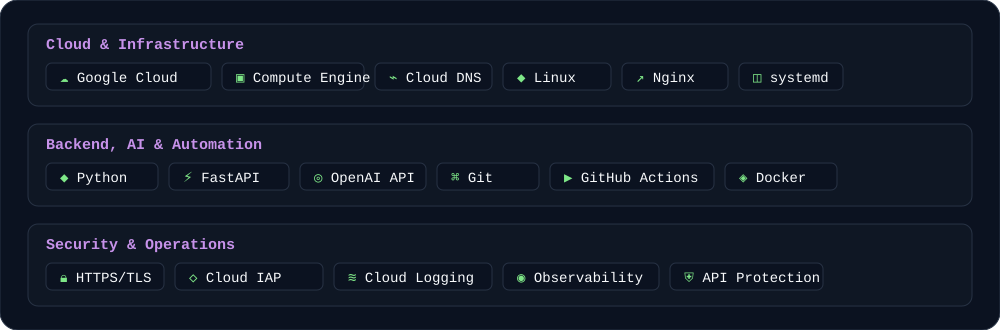

<div align="center">


# Yasser Mendoza

### Cloud Engineer in Progress

**Google Cloud · Linux · OpenAI · Automation · Security**

Building production-minded cloud systems with a hands-on focus on infrastructure, operations, and AI-backed applications.

[](https://yassermendoza.com)


</div>

---

## `01 / About`

I am building toward a career as a **Cloud Engineer**, focused on **Google Cloud Platform** and the practices that make systems secure, reliable, observable, and repeatable.

I learn by building real projects that combine **cloud infrastructure, Linux administration, backend systems, automation, security, and OpenAI-powered features**.

```text
Primary direction   → Cloud Engineering
Cloud platform      → Google Cloud Platform
Focus               → Infrastructure · Security · Automation · Observability
Working with        → Linux · Python · FastAPI · OpenAI · GitHub Actions
Location            → LATAM
```

## `02 / Core Stack`



## `03 / Featured Project`

### ☁️ Cloud & AI Portfolio — Production

A production portfolio built as a hands-on Cloud Engineering project on **Google Cloud Platform**.

**Live:** [yassermendoza.com](https://yassermendoza.com)

It demonstrates:

- Google Cloud infrastructure with Compute Engine and Cloud DNS
- Linux administration and Nginx reverse proxying
- Python + FastAPI backend development
- Restricted administrative access through Google Cloud IAP
- HTTPS/TLS with Let's Encrypt
- Deterministic Git-based deployments
- GitHub Actions CI, structured logging, and request-level observability
- Backend-only OpenAI API integration with protected server-side credentials

<details>
<summary><strong>Explore the architecture</strong></summary>

<br>

```text
Visitor
   │ HTTPS
   ▼
Google Cloud DNS
   ▼
Compute Engine
   ▼
Nginx
   ├── Static Frontend
   └── /api/*
          ▼
       FastAPI
          ▼
       AI Service
          ├── Professional Knowledge Base
          └── OpenAI Responses API

Operations
   ├── Google Cloud Logging
   ├── Ops Agent
   ├── GitHub Actions
   └── Deterministic deployment workflow
```

The backend is not exposed directly to the Internet; public traffic is routed through Nginx.

</details>

## `04 / Cloud Engineering Journey`


## `05 / Next Milestones`

- [ ] Build reusable GCP infrastructure with Terraform
- [ ] Strengthen container-based deployment workflows
- [ ] Expand CI/CD toward controlled delivery
- [ ] Deepen monitoring, alerting, and SRE practices

---

<div align="center">

### Build. Secure. Automate. Observe. Improve.

[Portfolio](https://yassermendoza.com) · [GitHub](https://github.com/SodaTrip)

</div>
