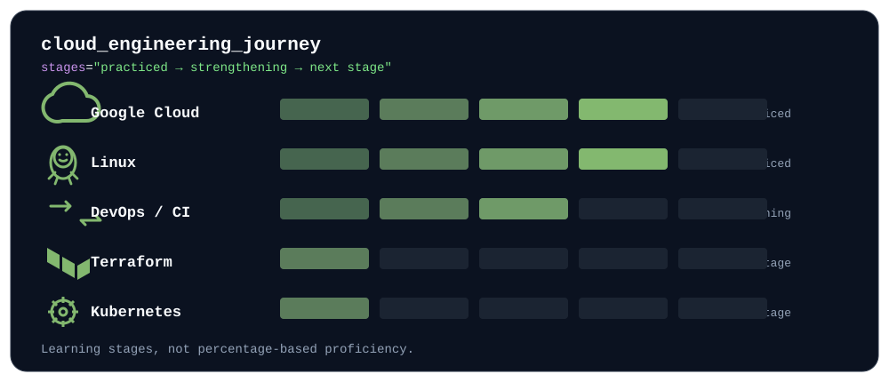

<div align="center">



# Yasser Mendoza

### Cloud Engineer in Progress

**Google Cloud · Linux · Infrastructure · Automation · Security**

Building production-minded cloud systems and documenting the engineering decisions behind them.

[](https://yassermendoza.com)


</div>

---

## `01 / About`

I am building toward a career as a **Cloud Engineer**, with a primary focus on **Google Cloud Platform** and the engineering practices that make cloud systems secure, reliable, observable, and repeatable.

My approach is hands-on: I use real projects to develop skills across cloud infrastructure, Linux administration, backend systems, security, CI/CD, observability, and technical documentation.

```text
Primary direction   → Cloud Engineering
Cloud platform      → Google Cloud Platform
Engineering focus   → Infrastructure · Security · Automation · Observability
DevOps foundation   → Git · GitHub Actions · Docker · CI/CD
Location            → LATAM
```

## `02 / Currently`

| | Focus |
|---|---|
| **Building** | Production-oriented cloud infrastructure and a Cloud + AI professional portfolio |
| **Strengthening** | GCP, Linux, networking, security, deployment workflows, observability |
| **Learning next** | Terraform, Kubernetes, deeper CI/CD, SRE practices |
| **Career target** | Cloud Engineer → Senior Cloud Engineer |

## `03 / Core Stack`

**Cloud & Infrastructure**

`Google Cloud Platform` · `Compute Engine` · `Cloud DNS` · `Cloud Logging` · `Linux` · `Nginx` · `systemd`

**Backend & Automation**

`Python` · `FastAPI` · `Pydantic` · `Git` · `GitHub Actions` · `Docker` · `Docker Compose`

**Security & Operations**

`HTTPS/TLS` · `Google Cloud IAP` · `Rate Limiting` · `Input Validation` · `Structured Logging` · `Request Tracing`

## `04 / Featured Project`

### ☁️ Cloud & AI Portfolio — Production

A production portfolio built as a hands-on Cloud Engineering project on **Google Cloud Platform**.

**Live:** [yassermendoza.com](https://yassermendoza.com)

It demonstrates:

- Google Cloud infrastructure with Compute Engine and Cloud DNS
- Linux server administration
- Nginx as web server and reverse proxy
- Python + FastAPI backend development
- Restricted administrative access through Google Cloud IAP
- HTTPS/TLS with Let's Encrypt
- Git-based deterministic deployments
- Automated backend testing and CI with GitHub Actions
- Structured application logging with Google Cloud Logging
- Request-level and AI-provider observability
- Public API validation, rate limiting, timeouts, and controlled errors
- Backend-only OpenAI integration with server-side credentials

<details>
<summary><strong>Explore the architecture</strong></summary>

<br>

```text
Visitor
   │
   │ HTTPS
   ▼
Google Cloud DNS
   │
   ▼
Compute Engine
   │
   ▼
Nginx
   ├──────────────► Static Frontend
   │
   └── /api/*
          │
          ▼
       FastAPI
          │
          ▼
       AI Service
          ├── Professional Knowledge Base
          └── OpenAI Responses API

Operations
   ├── Google Cloud Logging
   ├── Ops Agent
   ├── GitHub Actions
   └── Deterministic deployment workflow
```

The backend is not exposed directly to the Internet; public application traffic is routed through Nginx.

</details>

## `05 / Cloud Engineering Journey`



The bars represent **learning stages rather than percentage-based proficiency**: what I have already practiced, what I am actively strengthening, and what comes next in the roadmap.

## `06 / Engineering Principles`

```text
Security is part of the architecture.

Automate what is repeatable.

Document what is operationally important.

Understand systems before abstracting them.

Observe production systems instead of guessing.

Build projects that demonstrate engineering decisions, not only technologies.
```

## `07 / What I Want My Repositories to Show`

I am intentionally building this GitHub around evidence of engineering ability:

- **Cloud projects** — architecture, networking, compute, IAM, operations
- **Infrastructure as Code** — repeatable GCP environments with Terraform
- **DevOps labs** — containers, CI/CD, deployment workflows
- **Linux labs** — administration, services, troubleshooting, hardening
- **Engineering documentation** — architecture decisions, runbooks, postmortems, and operational notes

## `08 / Next Milestones`

- [ ] Build reusable GCP infrastructure with Terraform
- [ ] Containerize and standardize application deployments
- [ ] Expand CI/CD from automated testing toward controlled delivery
- [ ] Deepen monitoring, alerting, and SRE practices
- [ ] Build Kubernetes fundamentals after the container/IaC foundation
- [ ] Publish additional recruiter-friendly Cloud Engineering projects

---

<div align="center">

### Build. Secure. Automate. Observe. Improve.

[Portfolio](https://yassermendoza.com) · [GitHub](https://github.com/SodaTrip)

</div>
